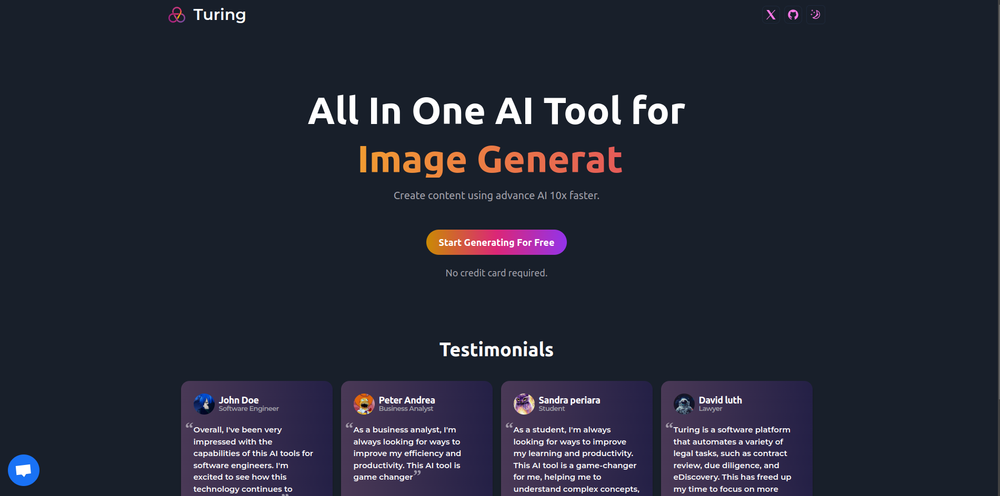

# TURING - AI SaaS Tool



## About The Project

In a world driven by technology, the demand for creative content has never been higher. From images and code to music and videos, businesses and individuals are constantly seeking innovative ways to stand out and engage their audiences. This AI SaaS (Software as a Service) platform is the answer to these needs, offering a comprehensive suite of AI-powered tools for content generation and an AI chatbot for seamless interaction.

The application is built using Next.js 13, Prisma, Stripe, and many other technologies. Additional information can be found below.

# Getting Started

## Requirements

- [git](https://git-scm.com/book/en/v2/Getting-Started-Installing-Git)
  - You'll know you did it right if you can run `git --version` and you see a response like `git version x.x.x`
- [Nodejs](https://nodejs.org/en/)
  - You'll know you've installed nodejs right if you can run:
    - `node --version` and get an ouput like: `vx.x.x`
- [NEXT.js](https://nextjs.org/docs/getting-started/installation)
  - You can now create a new React application by typing:
    - `npx create-next-app@latest my-app --typescript --tailwind --eslint`
- [Prisma](https://www.prisma.io/docs/getting-started/quickstart)
  - Please visit the site to setup and installation.
    - `npm install prisma --save-dev`
- [PlanetScale](https://planetscale.com/)
  - PlanetScale is a MySQL-compatible, serverless database platform.
  - Please visit the site for more information.
- [OpenAI](https://platform.openai.com/)
  - OpenAI is an AI research and deployment company.
    - `npm install openai`
- [Clerk](https://clerk.com/docs/quickstarts/nextjs)
  - Authentication and user management to your application.
  - `npm install @clerk/nextjs`
- [Stripe](https://clerk.com/docs/quickstarts/nextjs)
  - Online payment processing and commerce solutions for internet businesses.
  - `npm install --save stripe @stripe/stripe-js next`
- [Replicate](https://replicate.com/docs/get-started/nodejs)
  - Open source machine learning models.
  - `npm install replicate`

# Built With

- [Node.js](https://nodejs.org/en/)
- [TypeScript](https://www.typescriptlang.org/)
- [Tailwind](https://tailwindcss.com/)
- [Recharts](https://recharts.org/en-US/examples)
- [Shadcn](https://ui.shadcn.com/docs)

## Quickstart

Cloning the repository

```
git clone https://github.com/vaasanthk/ai-saas-turing.git
```

Install packages

```shell
npm i
```

### Setup .env file

```js
NEXT_PUBLIC_CLERK_PUBLISHABLE_KEY=
CLERK_SECRET_KEY=

NEXT_PUBLIC_CLERK_SIGN_IN_URL=/sign-in
NEXT_PUBLIC_CLERK_SIGN_UP_URL=/sign-up
NEXT_PUBLIC_CLERK_AFTER_SIGN_IN_URL=/dashboard
NEXT_PUBLIC_CLERK_AFTER_SIGN_UP_URL=/dashboard

OPENAI_API_KEY=
REPLICATE_API_TOKEN=

DATABASE_URL=

STRIPE_API_KEY=
STRIPE_WEBHOOK_SECRET=

NEXT_PUBLIC_APP_URL="http://localhost:3000"
```

### Setup Prisma

Add MySQL Database (PlanetScale)

```shell
npx prisma generate
npx prisma db push
npx prisma studio
```

### Start the app

```shell
npm run dev
```

# Thank you!
